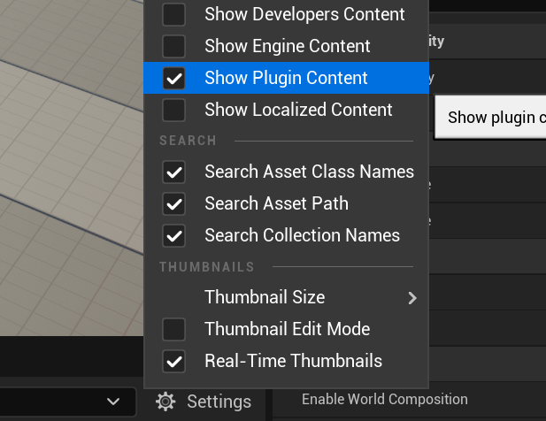

# VCCSim

VCCSIM is a comprehensive platform designed for 3D mapping and embodied AI agent training in large-scale open-world environments. The system integrates a suite of sensor components specifically engineered for expansive outdoor scenarios, intelligent agents, scene analysis and evaluation modules, and corresponding cross-platform APIs.

Leveraging Unreal Engine 5's advanced rendering capabilities, VCCSIM supports both static and dynamic environments, enabling realistic simulation of moving objects, changing lighting conditions, and environmental variations. This capability facilitates rapid, efficient, and precise development, testing, and evaluation of 3D mapping applications in scenarios that mirror real-world complexity. The platform's extensive API library and robust parallel processing architecture substantially enhance training efficiency for intelligent agents operating in large outdoor environments. Critically, the platform significantly reduces the simulation-to-reality gap (SIM2Real), which plays a key role in enhancing agent training outcomes and real-world deployment success.

*Attention: This work is still in early development and may not be stable. Please use it with caution.*

## Development Environment

I am using the following development environment.

We recommend using the same environment to avoid compatibility issues.

- Unreal Engine 5.4.4
- JetBrains Rider 2024.3.5 (Attention: Rider needs Visual Studio for essential environment toolkits)
- Windows 11 (We are not sure if it works on other platforms)

## HOW TO USE

### Server

1. Clone the core code.

   Clone this repository to your Unreal Engine 5 project's `Plugins` directory.

   For clone the submodules simultaneously, we recommend using the command below to clone the repository.

   ```bash
    git clone --recurse-submodules https://github.com/Marmiya/VCCSim
   ```

   If you have already cloned the repository without the `--recurse-submodules` option, you can clone the submodules with the command below.

   ```bash
   git submodule update --init --recursive
   ```

2. Setup the GRPC.

   Download the [GRPC for VCCSIM](https://drive.google.com/file/d/11rhmTjRyMszTzqDrmTah0v8Zu6GyfrNo/view?usp=drive_link)

   After downloading the file, extract it to the `Source` directory.

   You can also build the GRPC by yourself. But it is a bit complicated. The compiled result usually cannot be used directly with UE. So we recommend using our precompiled version.

   We will provide a guide for building the GRPC with UE5 by yourself soon.:)
3. Build the project.

   Make sure your directory structure is like below.
   - YourProject
     - Plugins
       - VCCSim
         - Source
           - VCCSim
           - pb
           - grpc
           - tomlplusplus

   Right click on the `.uproject` file and select `Generate Visual Studio project files`.

   *If an unexpected error occurred, we recommend deleting the `Intermediate` and `Saved` directories and trying again.*

   Then open the `.sln` file with your IDE(Visual Studio or JetBrains Rider).

   If you can see the `VCCSim` in the "Plugins" directory in the Explorer, you have successfully cloned the repository. For now, you can build the project and open the editor.
4. Settings in editor

   Check the `Show Plugin Content` in the `View Options` to see the plugin content.

   

   For now, you can see the `VCCSim` directory in the `Content` directory.

   

   In order to control the map, you need to set the `Game Instance Class` as `BP_VCCSimGameInstance` in the `Project Settings`.

   For each map you want to use the VCCSim, you need to set the `Game Mode Override` as `BP_VCCSimGameMode`.
5. Set experiment settings

   VCCSim uses the 'RSConfig.toml' file to set the experiment settings.

   The default place of 'RSConfig.toml' file is `/Plugins/VCCSim/Source/VCCSim`. But you can change the path in the `YourUser/VCCSim` directory.

   The specific settings are described in [Here](Resources/RSConfig.md).

## Keyboard Controls Reference

### General Pawn Controls

| Key | Function | Description |
|-----|----------|-------------|
| W | Move Forward | Move vehicle forward |
| A | Move Left | Move drone to the left / Let the car turn left |
| S | Move Backward | Move vehicle backward |
| D | Move Right | Move drone to the right / Let the car turn right|
| Space | Ascend | Drone ascends |
| Left Shift (*TODO*)| Sprint/Boost | Increase movement speed |
| Left Ctrl | Descend | Drone descends |
| M | Pause Game | Pause the game and show pause menu |

### Camera Controls

| Key | Function | Description |
|-----|----------|-------------|
| Mouse Movement | Look Around | Control camera direction |
| Mouse Wheel (*TODO*) | Zoom | Zoom camera in/out |
| C (*TODO*) | Free Camera | Toggle free camera mode |

### Simulation Controls

| Key | Function | Description |
|-----|----------|-------------|
| R | Toggle Recording | Start/stop recording simulation data |
| 6 | RGB Subwindow | Show/hide Subwindow |
| 7 | Static Mesh Subwindow | Show/hide Subwindow |
| 8 | Dynamic Mesh Subwindow | Show/hide Subwindow |
| 9 | PointCloud Subwindow | Show/hide Subwindow |
| 0 | Depth Subwindow | Show/hide Subwindow |
| Y | Save RGB Subwindow | Save Subwindow content |
| U | Save Static Mesh Subwindow | Save Subwindow content |
| I | Save Dynamic Mesh Subwindow | Save Subwindow content |
| O | Save PointCloud Subwindow | Save Subwindow content |
| P | Save Depth Subwindow | Save Subwindow content |

### Notes

- You can customize these key bindings as needed
- Some functions may only be available in specific simulation modes

### Client Configuration

GRPC used in the client side is not effected by the Unreal Engine. So you can use any language that supports GRPC. We provide the Python and C++ client for the VCCSim. You can find the client code in the `Client` directory.

#### Python

[Python Client](Client\PyClient\Readme.md)

#### C++

[Cpp Client](Client\CppClient\Readme.md)